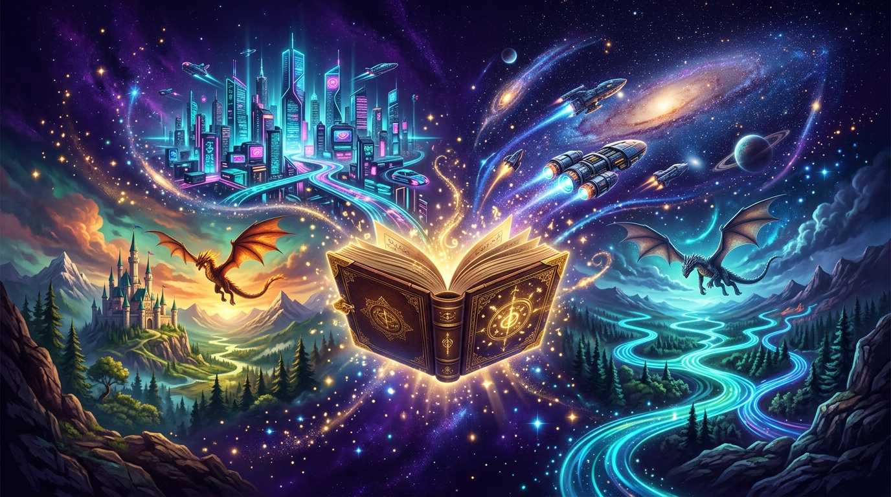
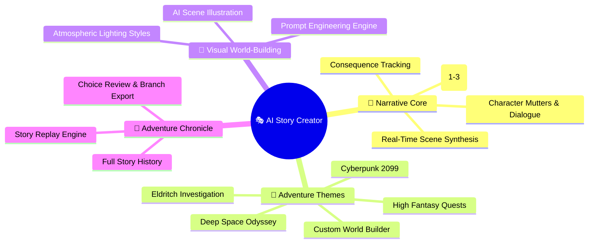
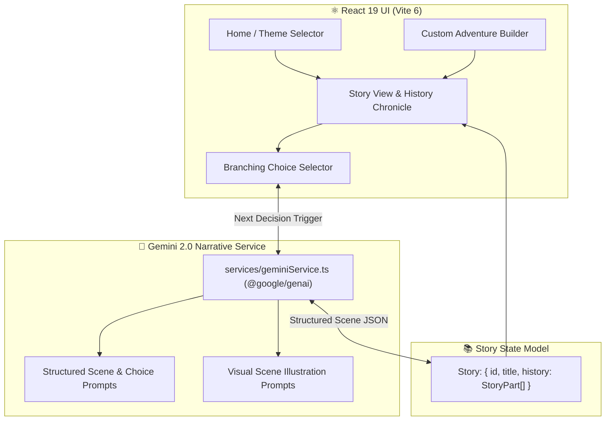

<!-- 🎭 AI STORY CREATOR — REPOSITORY PRESENTATION (L3 SHOWCASE) -->

<div align="center">



# **🎭 AI Story Creator**

**An interactive multi-genre narrative synthesis studio, branching choose-your-own-adventure engine, and dynamic scene illustrator powered by React 19, TypeScript, and Google Gemini 2.0.**

[](#-core-features)
[](package.json)
[](tsconfig.json)
[](vite.config.ts)
[](package.json)
[](LICENSE)
[](https://github.com/traikdude/AI-Story-Creator-)

<p align="center">
  <a href="#-overview"><b>Overview</b></a> •
  <a href="#-core-features"><b>Features</b></a> •
  <a href="#-adventure-genres"><b>Genres</b></a> •
  <a href="#-narrative-engine--data-flow"><b>Engine</b></a> •
  <a href="#-architecture"><b>Architecture</b></a> •
  <a href="#-quick-start--local-development"><b>Quick Start</b></a> •
  <a href="#-contributing"><b>Contributing</b></a> •
  <a href="#-license"><b>License</b></a>
</p>

</div>

---

## 📑 Table of Contents

- [✨ Overview](#-overview)
- [🚀 Core Features](#-core-features)
  - [1. Dynamic Branching Narrative Engine](#1-dynamic-branching-narrative-engine)
  - [2. Pre-Built & Custom World Themes](#2-pre-built--custom-world-themes)
  - [3. Multi-Modal Scene Illustration Generation](#3-multi-modal-scene-illustration-generation)
  - [4. Complete Adventure Chronicle & Story History](#4-complete-adventure-chronicle--story-history)
- [🌌 Adventure Genres & World Settings](#-adventure-genres--world-settings)
- [🏗️ Narrative Engine & Data Flow](#-narrative-engine--data-flow)
- [🛠️ Tech Stack](#-tech-stack)
- [⚡ Quick Start & Local Development](#-quick-start--local-development)
- [🗂️ Repository Structure](#-repository-structure)
- [🤝 Contributing](#-contributing)
- [📄 License](#-license)

---

## ✨ Overview

**AI Story Creator** is an interactive storytelling engine and visual narrative sandbox designed to bring dynamic, choice-driven fictional universes to life.

By leveraging **Google Gemini 2.0 (via `@google/genai`)**, the platform constructs rich, multi-layered branching storylines on the fly. Each scene delivers character mutters, atmospheric prose, dramatic actions, and actionable branching decisions while simultaneously generating vivid image prompts for visual world-building.

---

## 🚀 Core Features



### 1. Dynamic Branching Narrative Engine
Generates coherent, episodic story parts containing character monologues, atmospheric descriptions, actions, and 3 meaningful paths forward.

### 2. Pre-Built & Custom World Themes
Jump into curated worlds with tailored keywords and aesthetic palettes, or forge custom universes by defining core factions, magic systems, and technologies.

### 3. Multi-Modal Scene Illustration Generation
Synthesizes descriptive image generation prompts for every scene and renders matching visual artwork for immersive reading.

### 4. Complete Adventure Chronicle & Story History
Maintains full chronological state across every user decision, allowing readers to review their complete journey from prologue to climax.

---

## 🌌 Adventure Genres & World Settings

| Theme | Setting & Lore | Narrative Focus |
|---|---|---|
| 🏙️ **Cyberpunk Neon** | Dystopian megacities, rogue AI syndicates, neural implants | Corporate espionage, black market netrunning, street survival |
| 🐉 **High Fantasy** | Enchanted realms, ancient dragons, forbidden magical arcana | Heroic quests, relic recovery, political intrigue in royal courts |
| 🚀 **Deep Space** | Derelict generation ships, uncharted exoplanets, alien monoliths | Survival exploration, first contact, deep space navigation |
| 🕯️ **Eldritch Mystery** | Fog-drenched 1920s towns, occult secret societies, cosmic horrors | Investigation, sanity management, uncovering ancient grimoires |
| ⚙️ **Steampunk Aether** | Victorian airships, clockwork automata, aether crystal propulsion | Sky piracy, industrial espionage, revolutionary alchemy |

---

## 🏗️ Narrative Engine & Data Flow



---

## 🛠️ Tech Stack

* **Frontend Framework**: React 19 (`react` 19.2.3, `react-dom` 19.2.3)
* **Language & Typing**: TypeScript 5.8.2 (`tsconfig.json`)
* **Build System**: Vite 6.2.0 (`vite.config.ts`)
* **AI Orchestration SDK**: Google GenAI SDK (`@google/genai` 1.36.0)
* **Iconography**: Lucide React (`lucide-react` 0.562.0)
* **Styling**: Tailwind CSS with custom neon-dark thematic gradients

---

## ⚡ Quick Start & Local Development

### Prerequisites
* [Node.js](https://nodejs.org/) (v18+ or v20+)
* [Google Gemini API Key](https://aistudio.google.com/)

### Setup Instructions
1. Clone the repository:
   ```bash
   git clone https://github.com/traikdude/AI-Story-Creator-.git
   cd AI-Story-Creator-
   ```
2. Install dependencies:
   ```bash
   npm install
   ```
3. Set your Gemini API key in `.env.local`:
   ```bash
   VITE_GEMINI_API_KEY="your-gemini-api-key-here"
   ```
4. Launch development server:
   ```bash
   npm run dev
   ```
5. Open `http://localhost:5173` in your browser.

---

## 🗂️ Repository Structure

```text
AI-Story-Creator-/
├── docs/                        # Presentation & visual assets
│   └── assets/
│       └── banner.png           # L3 Showcase high-resolution hero banner
├── components/                  # Story cards, scene view, choice buttons
├── pages/                       # HomePage, CustomStoryPage, StoryView
├── services/                    # Gemini API story & image prompt generators
├── constants.ts                 # Pre-configured adventure themes & lore
├── types.ts                     # TypeScript interfaces (Story, Scene, Choice)
├── App.tsx                      # Main application coordinator
├── index.html                   # HTML entry shell
├── index.tsx                    # React 19 DOM entrypoint
├── package.json                 # Project dependencies & scripts
├── tsconfig.json                # TypeScript compiler configuration
├── vite.config.ts               # Vite bundler configuration
├── README.md                    # L3 Showcase presentation documentation
└── LICENSE                      # MIT Open Source License
```

---

## 🤝 Contributing

1. Fork the repository and create your branch (`git checkout -b feature/new-adventure-theme`).
2. Add new adventure settings to `constants.ts` or enhance story prompts in `services/`.
3. Verify that the build succeeds without errors: `npm run build`.
4. Submit a Pull Request.

---

## 📄 License

Distributed under the **MIT License**. See [LICENSE](LICENSE) for details.

---

<div align="center">

*Engineered for Storytellers, Roleplayers & AI Narrative Architects.*  
**AI Story Creator · React 19 · TypeScript · Google GenAI · Vite**

</div>
